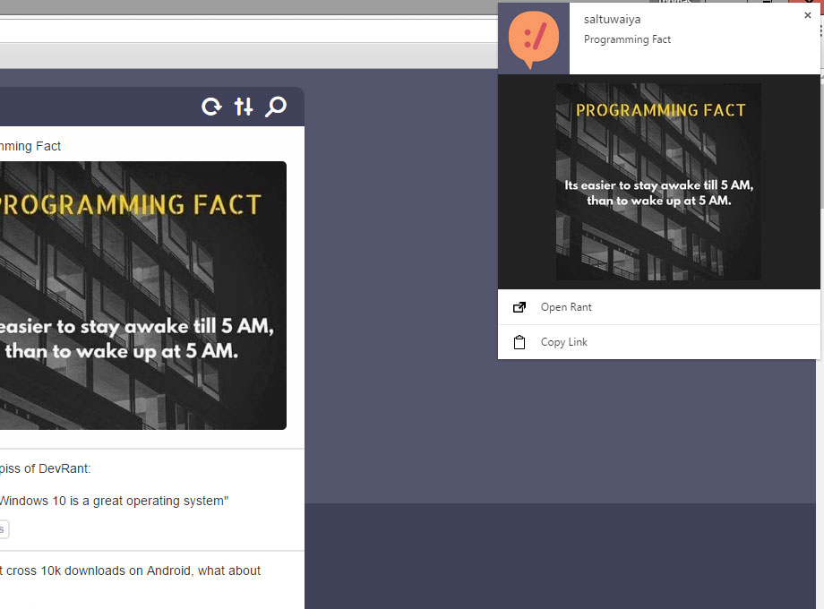

Chrome Extension: Notifications for devRant
===========================================

 

This extension for chrome will display notifications when a new rant is
posted on https://devrant.io.

On the notifications you will have the option to share it or to open it
in your browser.

Features
--------

* Notification for new rants
* Open rant from notification
* Copy link to rant from notification
* Image preview for image rants

How to Install
--------------

To install this extension you:

1. Download the latest [.crx file].
2. Open the Extensions page (chrome://extensions) in chrome.
3. Drop the [.crx file] onto the page.

[.crx file]: https://github.com/ChappIO/devrant-chrome-extension/releases/latest

Status Chrome Web Store
-----------------------

This chrome extension is currently under review.

Changelog
---------

You can find the change log [here](CHANGELOG.md).
